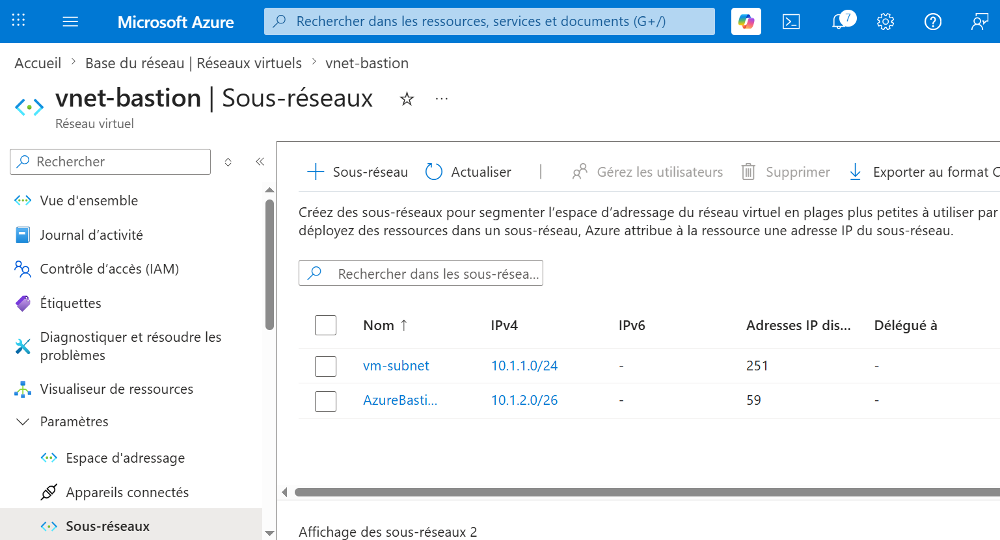
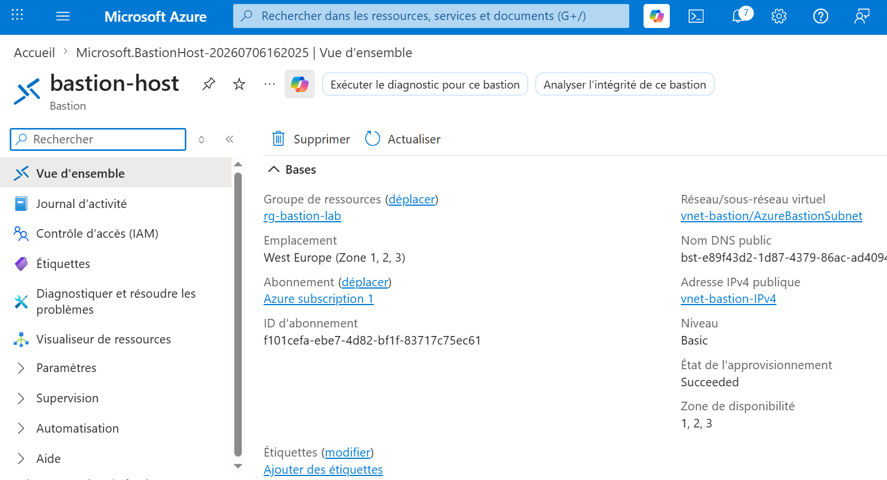
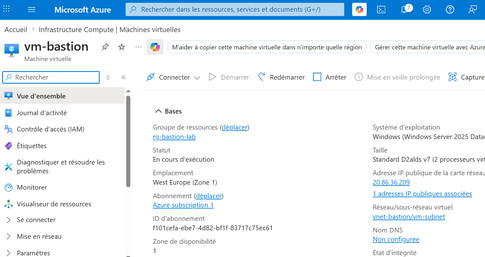
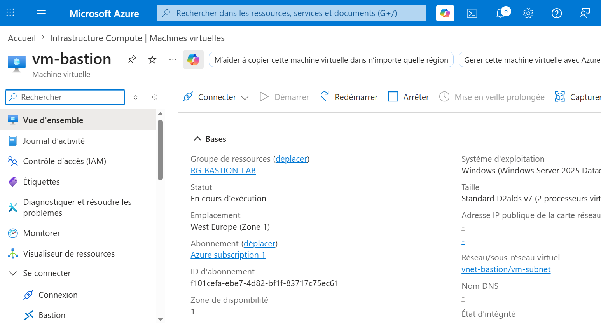
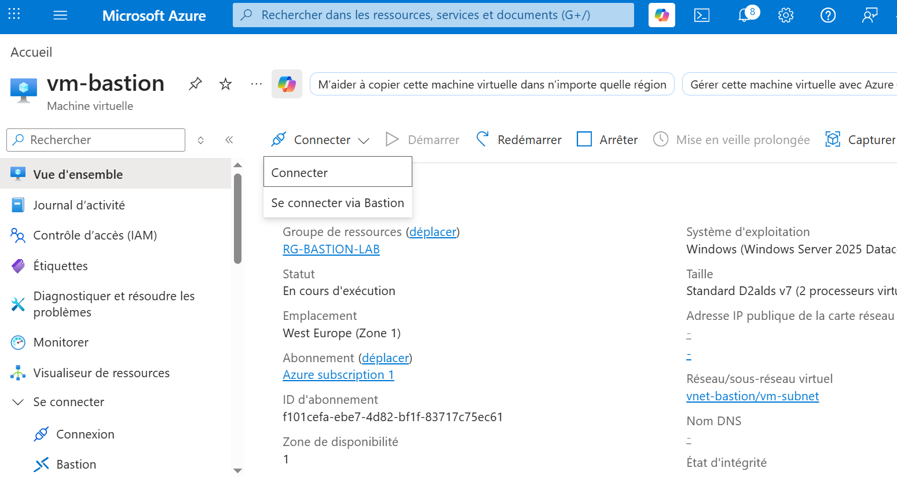
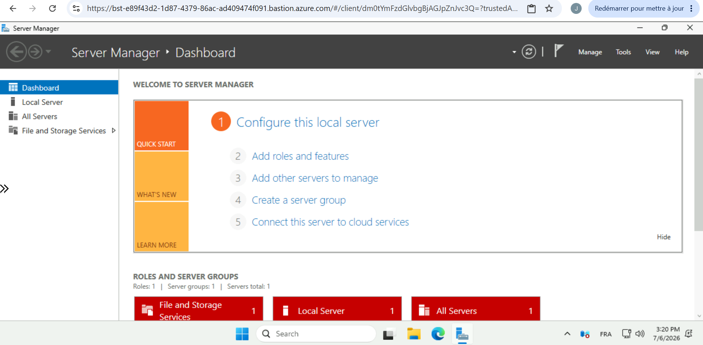

# Azure Bastion Lab

## 🎯 Objectif

Déployer et configurer Azure Bastion afin d'administrer une machine virtuelle Windows Server sans exposer de port RDP ni d'adresse IP publique.

Ce projet a été réalisé dans le cadre de ma préparation à la certification Microsoft Azure AZ-104 afin de renforcer mes compétences en administration réseau et en sécurisation des accès sur Azure.

---

## 🛠️ Technologies utilisées

- Microsoft Azure
- Azure Bastion
- Windows Server 2025
- Virtual Network (VNet)
- Network Security Groups (NSG)

---

## 🏗️ Architecture

```text
                Internet
                    │
                    ▼
             Azure Bastion
                    │
                    ▼
           Windows Server VM
          (Adresse IP privée)
```

---

## ✅ Résultat

La machine virtuelle est administrée exclusivement via Azure Bastion.

L'adresse IP publique de la machine virtuelle a été supprimée afin d'empêcher toute connexion RDP directe depuis Internet.

L'administration est réalisée de manière sécurisée directement depuis le portail Azure.

---

## 👤 Auteur

**Jair Da Silva**

Support IT N1/N2 | Technicien Systèmes & Réseaux | Cloud Azure

- GitHub : https://github.com/jairdasilva-it
- LinkedIn : https://www.linkedin.com/in/jair-da-silva-6b14aa278

---

## 1️⃣ Création du réseau

- Création d'un Virtual Network
- Création du sous-réseau **vm-subnet**
- Création du sous-réseau **AzureBastionSubnet**

---

## 2️⃣ Déploiement de la machine virtuelle

- Création d'une machine virtuelle Windows Server 2025
- Configuration de la carte réseau
- Déploiement dans le sous-réseau **vm-subnet**

---

## 3️⃣ Déploiement d'Azure Bastion

- Création du service Azure Bastion
- Association au sous-réseau **AzureBastionSubnet**
- Attribution d'une adresse IP publique au Bastion

---

## 4️⃣ Sécurisation de la machine virtuelle

- Suppression de l'adresse IP publique de la VM
- Vérification que la VM n'est plus accessible directement via Internet

---

## 5️⃣ Validation

- Connexion réussie via Azure Bastion
- Ouverture de la session Windows Server directement depuis le portail Azure

---

# 📸 Captures d'écran

## 1. Virtual Network et sous-réseaux



---

## 2. Azure Bastion



---

## 3. Machine virtuelle



---

## 4. Machine virtuelle sans adresse IP publique



---

## 5. Connexion via Azure Bastion



---

## 6. Session Windows Server



---

## 💼 Compétences démontrées

- Administration Microsoft Azure
- Azure Bastion
- Sécurisation des accès
- Administration Windows Server
- Réseaux virtuels (VNet)
- Sous-réseaux Azure
- Gestion des adresses IP publiques
- Bonnes pratiques de sécurité Cloud
